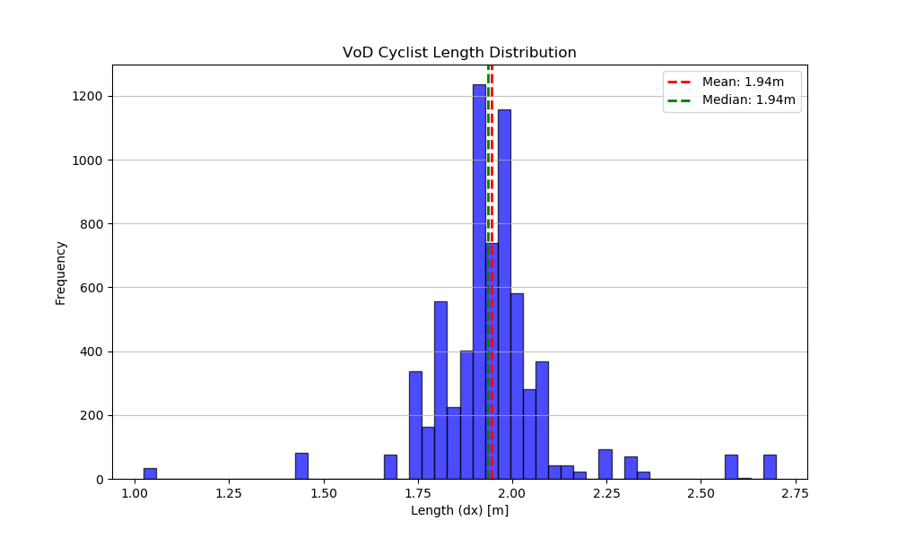

# RadarPillars: Efficient Object Detection from 4D Radar Point Clouds
## OpenPCDet (Astyx + VoD)

Bu fork, Astyx ve View-of-Delft (VoD) radar verileri ile radar-only RadarPillars/PointPillar
eğitimi için düzenlenmiş OpenPCDet türevidir. LiDAR/çekirdek kod korunurken, görüntü
bağımlılıkları kaldırıldı ve radar hız/rcs özellikleri eklendi.


## Overview
- [Changelog](#changelog)
- [Astyx Radar Quickstart](#astyx-radar-quickstart)
- [VoD Radar Quickstart](#vod-radar-quickstart)
- [Design Pattern](#openpcdet-design-pattern)
- [Model Zoo](#model-zoo)
- [Installation](docs/INSTALL.md)
- [Quick Demo](docs/DEMO.md)
- [Getting Started](docs/GETTING_STARTED.md)
- [Citation](#citation)


## Changelog
[2026-01] Astyx radar pipeline: 7 özellikli (x,y,z,rcs,vr,vx,vy) point loader, hız uyumlu augmentasyonlar, `tools/cfgs/astyx_models/astyx_radarpillar.yaml`.
[2026-02] VoD radar pipeline: dataset config, info üretimi, `tools/cfgs/vod_models/vod_radarpillar.yaml`.
[2026-02] WandB entegrasyonu: Eğitim metriklerini takip etmek için `--use_wandb` bayrağı eklendi.

## WandB Entegrasyonu ve Kullanımı

Eğitim süreçlerinizi Weights & Biases (WandB) üzerinden takip etmek için aşağıdaki adımları izleyin:

1. **Kurulum**:
   Eğer `.venv` kullanıyorsanız, aktif ettiğinizden emin olun:
   ```bash
   source .venv/bin/activate
   ```

2. **Giriş Yapma**:
   WandB hesabınıza terminal üzerinden giriş yapın:
   ```bash
   wandb login
   ```
   API anahtarınızı [WandB Settings](https://wandb.ai/settings) sayfasından alabilirsiniz.

3. **Eğitimi Başlatma**:
   Eğitim komutuna `--use_wandb` bayrağını ekleyerek metriklerin WandB'ye gönderilmesini sağlayın:
   ```bash
   python tools/train.py --cfg_file tools/cfgs/vod_models/vod_radarpillar.yaml --use_wandb
   ```

## Astyx Radar Quickstart

- Ortam: Python 3.8/3.9, PyTorch 2.4+cu12, spconv 2.3.6. Öneri:
  ```bash
  python -m venv .venv
  source .venv/bin/activate
  python -m pip install -U pip
  python setup.py develop
  ```
- Veri yapısı (radar-only): `data/astyx/training/` ve `data/astyx/testing/` altında `radar/*.bin` dosyaları, `ImageSets/train.txt`, `val.txt`, `test.txt`.
- Info + gt database üretimi:
  ```bash
  python -m pcdet.datasets.astyx.astyx_dataset create_astyx_infos tools/cfgs/dataset_configs/astyx_dataset_radar.yaml
  ```
- Eğitim (PointPillar, 0.2 m x-y, 4 m z pillar):
  ```bash
  CUDA_VISIBLE_DEVICES=0 python tools/train.py --cfg_file tools/cfgs/astyx_models/astyx_radarpillar.yaml --batch_size 4
  ```
- Eval:
  ```bash
  CUDA_VISIBLE_DEVICES=0 python test.py --cfg_file tools/cfgs/astyx_models/astyx_radarpillar.yaml --ckpt <ckpt_path>
  ```

## VoD Radar Quickstart

- Veri yapısı: `data/VoD/view_of_delft_PUBLIC/radar_5frames` altında radar verisi ve anotasyonlar.
- Train/val/test split dosyaları (ImageSets) örnek yerleşim:
  ```text
  data/VoD/view_of_delft_PUBLIC/radar_5frames/
    ImageSets/
      train.txt
      val.txt
      test.txt
    training/
      velodyne/
      label_2/
      calib/
      image_2/
      planes/
    testing/
      velodyne/
  ```
- Info + gt database üretimi:
  ```bash
  python -m pcdet.datasets.vod.vod_dataset create_vod_infos tools/cfgs/dataset_configs/vod_dataset_radar.yaml
  ```
- Eğitim:
  ```bash
  CUDA_VISIBLE_DEVICES=0 python tools/train.py --cfg_file tools/cfgs/vod_models/vod_radarpillar.yaml --batch_size 4
  ```
- Eval:
  ```bash
  CUDA_VISIBLE_DEVICES=0 python test.py --cfg_file tools/cfgs/vod_models/vod_radarpillar.yaml --ckpt <ckpt_path>
  ```


## Dataset Visualization & Anchor Verification

Veri setindeki nesne dağılımlarını analiz etmek ve anchor boyutlarının (şablon kutular) doğruluğunu kontrol etmek için aşağıdaki araçları kullanabilirsiniz.

### 1. Anchor Doğrulama Grafiği
Bu grafik, veri setindeki gerçek nesne boyutlarını (bulut şeklinde) ve üzerine yerleştirilen Baseline (v5) ile Master (v7) anchor'larını gösterir. Master sürümündeki bisikletli performans kaybının, anchor boyutunun veri ortalamasından çok büyük seçilmesinden kaynaklandığı burada görselleştirilmiştir.


*   **Siyah Çarpı (Baseline):** 1.59m - Veri merkezine tam oturur.
*   **Mavi Baklava (Master):** 1.94m - Veri bulutu dışına sapmıştır.

### 2. Cyclist Uzunluk Dağılımı (Histogram)
Bu grafik, `Cyclist` sınıfının aslında iki farklı gruptan (durağan bisikletler ve hareketli sürücüler) oluştuğunu ve tek bir anchor'ın neden "orta yol" (1.62m) değerinde olması gerektiğini gösterir.



### İzleme ve Analiz Komutları
Veri setini kendi başınıza analiz etmek için şu scriptleri çalıştırabilirsiniz:

```bash
# Nesne boyutlarını dağılım grafiği olarak kaydeder (tools/anchor_verification.png)
python tools/visualize_anchors.py

# Cyclist sınıfı için detaylı histogram üretir (tools/cyclist_dist.png)
python tools/plot_cyclist_dist.py

# Veri setindeki (PKL vs Raw Label) tutarlılığı kontrol eder
python tools/check_data_consistency.py
```


## License

`OpenPCDet` is released under the [Apache 2.0 license](LICENSE).

## Acknowledgement
Bu proje, [OpenPCDet](https://github.com/open-mmlab/OpenPCDet) açık kaynak 3D nesne algılama framework'ü üzerine inşa edilmiştir.
Orijinal kod tabanı ve desteklenen yöntemler için OpenPCDet ekibine teşekkür ederiz.

## Citation
```
@inproceedings{shi2020pv,
  title={Pv-rcnn: Point-voxel feature set abstraction for 3d object detection},
  author={Shi, Shaoshuai and Guo, Chaoxu and Jiang, Li and Wang, Zhe and Shi, Jianping and Wang, Xiaogang and Li, Hongsheng},
  booktitle={Proceedings of the IEEE/CVF Conference on Computer Vision and Pattern Recognition},
  pages={10529--10538},
  year={2020}
}
```
